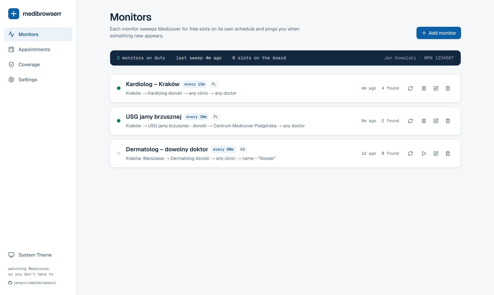
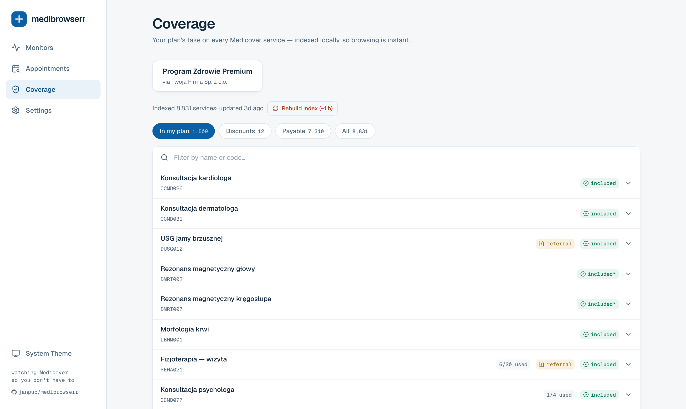
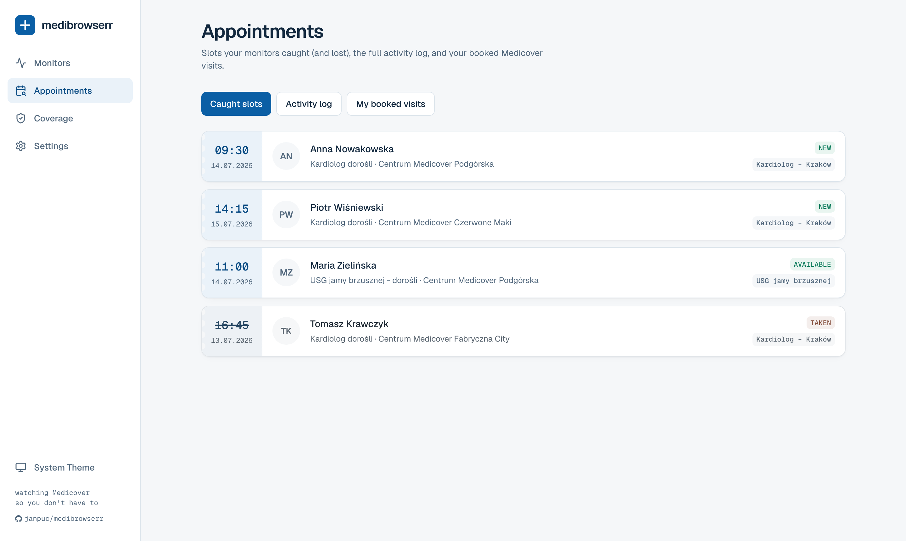
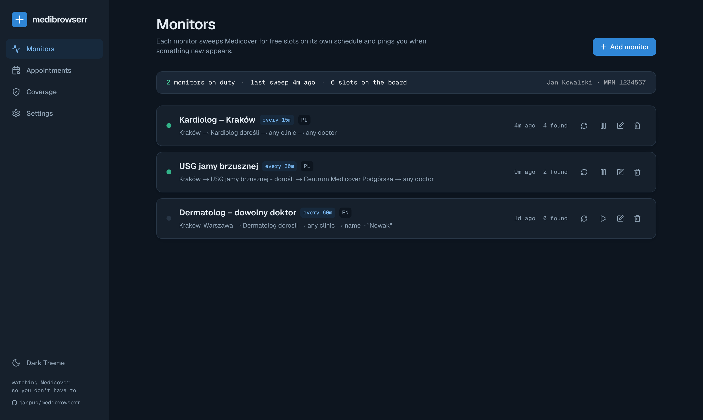

<picture>
  <source media="(prefers-color-scheme: dark)" srcset="docs/logo-wordmark-dark.png">
  
</picture>

[](https://github.com/janpuc/medibrowserr/actions/workflows/ci.yml)
[](https://github.com/janpuc/medibrowserr/releases)
[](https://ghcr.io/janpuc/medibrowserr)
[](LICENSE)

Self-hosted appointment watcher for **Medicover Poland**. It sweeps the
Medicover OnLine (online24) API for free slots on your schedule, keeps the
finds in SQLite, and pings you via **Pushover, Telegram, Gotify or ntfy** the
moment something new appears — with default messages in Polish or English,
your pick per monitor.

Inspired by [medihunter](https://github.com/apqlzm/medihunter), rebuilt as a
proper web app for self-hosting.



<details>
<summary>More screenshots — coverage, appointments, dark mode</summary>





</details>

*(Screenshots show sample data. Logo available in [`docs/logo.svg`](docs/logo.svg) / [`docs/logo.png`](docs/logo.png).)*

## Features

- **Monitors** — saved searches that run on an interval (default 15 min):
  pick a specialty and go; regions, clinics, interval and language come from
  your configured defaults. Narrow to specific clinics, doctors from the live
  dictionary or a "doctor name contains" filter, date/hour windows, doctor
  language, consultation vs diagnostic. **Preview results** before saving.
- **Notifications via Pushover, Telegram, Gotify and ntfy** — every configured
  channel gets every alert. Default messages in PL/EN (chosen per monitor),
  optional per-monitor message templates with live preview and a test-send
  button, priority per monitor, optional **quiet hours** (overnight alerts
  arrive silently instead of waking you).
  The lifecycle is noise-free by design:
  - new slots (or ones that came back after a cancellation) → one alert with
    the whole list;
  - a slot seen again on a later sweep → silence;
  - a future slot that vanished (someone booked it) → a heads-up one priority
    step lower; past-dated slots expire silently.
  Notifications link back to this app when its URL is configured.
- **Activity log** — every found / taken / expired slot in one chronological
  feed; taken slots also stay visible (grayed out) among the caught tickets.
- **Coverage checker** — browse or search the full Medicover service catalog
  and see how *your* plan treats each service: covered, referral required,
  volume/value limits (with usage), discount or payable.
- **Appointments** — every caught slot as a waiting-room ticket, plus your
  booked visits from Medicover.
- **SQLite** storage, single container, no external services.
- **Prometheus `/metrics`** — monitors, slot lifecycle, notification results,
  coverage index state (use `basic_auth` in your scrape config when
  `MEDIBROWSERR_BASIC_AUTH` is set).
- **Backup & restore** — settings + monitor configs as JSON from the Settings
  page; imports never override env-pinned values.

## How login works (read this once)

Medicover's online24 login is OIDC with PKCE, driven server-side by the app.
Medicover **requires an MFA method on every account**. The first time you
connect:

1. Enter card number + password in **Settings** (or seed via env vars).
2. Click **Connect**. If your account has no MFA method yet, the app walks
   you through the one-time setup: pick **Email** or **SMS**, receive a
   6-digit code, type it in.
3. The app marks its device as trusted and stores the refresh token in
   SQLite — from then on everything is automatic, across restarts.

If Medicover ever demands a new code (e.g. token revoked), monitors pause,
you get a Pushover "action required" ping, and the Settings page shows the
code prompt again.

## Running it

```bash
docker compose up -d
# open http://localhost:3000 → Settings → connect Medicover + Pushover
```

Or with plain `docker run` / any orchestrator — the image is unopinionated:

```bash
docker run -d -p 3000:3000 -v medibrowserr-data:/data \
  ghcr.io/janpuc/medibrowserr:latest
```

What the container needs:

| Mount / port | Purpose |
| --- | --- |
| `/data` (volume, **required**) | SQLite database: settings, Medicover session (tokens + trusted device), monitors, caught slots. Lose it and you redo the MFA dance. |
| `3000/tcp` | HTTP. Health endpoint: `GET /api/health`. |

There is no cache directory — fonts and assets are baked into the image at
build time, and dictionaries are fetched live.

Run **exactly one instance** per database: SQLite plus the in-process
scheduler don't share. On Kubernetes that means `replicas: 1` with a
`Recreate` strategy and a ReadWriteOnce PVC mounted at `/data`.

> **Security note:** the app ships without authentication by default. Keep it
> on an internal network, put an auth proxy in front of it, or at minimum set
> `MEDIBROWSERR_BASIC_AUTH=user:password` for built-in HTTP Basic Auth. Your
> Medicover password and tokens live in the SQLite database.

## Configuration

Everything is configurable in the Settings page. Env vars are optional
overrides — a value set via env **wins over the GUI and shows up locked**
(grayed out) there:

| Env var | Purpose |
| --- | --- |
| `DATABASE_URL` | SQLite location (`sqlite://` or `file:` URL). Image default: `sqlite:///data/medibrowserr.db` |
| `MEDICOVER_USER` / `MEDICOVER_PASS` | Medicover card number / password |
| `PUSHOVER_TOKEN` / `PUSHOVER_USER` / `PUSHOVER_DEVICE` | Pushover: **app API token** / **your user key** / optional device |
| `TELEGRAM_BOT_TOKEN` / `TELEGRAM_CHAT_ID` | Telegram bot token (@BotFather) and chat id |
| `GOTIFY_URL` / `GOTIFY_TOKEN` | Gotify server URL and application token |
| `NTFY_URL` / `NTFY_TOPIC` / `NTFY_TOKEN` | ntfy server (default `https://ntfy.sh`), topic, optional token |
| `MEDIBROWSERR_QUIET_HOURS_ENABLED` / `MEDIBROWSERR_QUIET_HOURS` | Quiet hours (silent delivery), e.g. `true` / `23-7` |
| `MEDIBROWSERR_DEFAULT_REGION_IDS` | Regions preselected in new monitors, comma-separated ids (e.g. `202` = Kraków) |
| `MEDIBROWSERR_DEFAULT_CLINIC_IDS` | Clinics preselected in new monitors, comma-separated ids |
| `MEDIBROWSERR_DEFAULT_LANGUAGE` | Default notification language, `pl` or `en` |
| `MEDIBROWSERR_DEFAULT_INTERVAL` | Default sweep interval in minutes |
| `MEDIBROWSERR_URL` | Public URL of this app — Pushover notifications link here (e.g. `https://medibrowserr.home.lan`) |
| `MEDIBROWSERR_BASIC_AUTH` | `user:password` — when set, the whole app (except `/api/health`) requires HTTP Basic Auth. A proper auth proxy is still preferred. |
| `PORT` | HTTP port. Image default: `3000` |
| `MEDIBROWSERR_USER_AGENT` | Override the browser User-Agent sent to Medicover (empty = built-in Chrome UA) |
| `MEDIBROWSERR_SEED_CONCURRENCY` / `MEDIBROWSERR_SEED_DELAY_MS` | Coverage-crawl pacing; defaults `2` / `300` ≈ 2.5 req/s. Raise at your own risk (see below) |
| `TZ` | Timezone for schedules/dates. Image default: `Europe/Warsaw` |

Region/clinic ids are visible in the Settings pickers (or via
`GET /api/medicover/filters`).

## Notification channels

Every configured channel receives every alert. Configure them in Settings →
Notifications (each has its own Test button) or via env vars.

**Pushover** — create an *application* at
[pushover.net/apps](https://pushover.net/apps/build); its **API Token/Key**
(~30 chars, starts with `a`) goes into "App API token". Your **User Key**
(starts with `u`) is on the top-right of the
[dashboard](https://pushover.net). Both are required — mixing them up is the
#1 setup mistake. Device name is optional (empty = all devices).

**Telegram** — create a bot with [@BotFather](https://t.me/BotFather) and use
its token (`12345:AAaa…`). Send your bot one message first (bots can't
initiate chats), then get your numeric chat id from
[@userinfobot](https://t.me/userinfobot). Group chats use ids starting with
`-100`.

**Gotify** — your server URL plus an *application* token (create one under
Apps in the Gotify UI; starts with `A`).

**ntfy** — works with [ntfy.sh](https://ntfy.sh) out of the box: pick a topic
and subscribe to it in the app. On public servers anyone who knows the topic
name can read it, so make it unguessable (e.g. `medibrowserr-x7k2m9`). Access
token (`tk_…`) only needed for protected topics/servers.

**Quiet hours** — when enabled (default `23-7`), alerts during the window are
delivered *silently* (lowest priority on every channel) instead of being
dropped — you'll see them in the morning without being woken at 3 am.

## Staying under Medicover's rate limits

medibrowserr talks to the same API your browser does, and Medicover's WAF
**will temporarily block IPs that hammer it** (it looks like connections
closing with no response — the app reports it plainly and backs off). Ground
rules baked into the defaults, worth keeping:

- **Monitor sweeps:** 15 min is a polite default. Don't run many monitors at
  5-minute intervals — they execute serially with gaps, but dozens of daily
  searches per monitor add up.
- **Coverage index:** the crawl is deliberately slow (~2.5 req/s → about an
  hour for the full catalog) and pauses itself for 20 minutes when Medicover
  starts refusing connections, resuming automatically with progress saved.
  Don't force-rebuild more than occasionally — it refreshes itself every
  3 weeks, and the catalog barely changes.
- **Logins:** repeated failed password logins lock the account for ~15
  minutes. The app logs in rarely (refresh tokens do the work).

Risks if you push it anyway: a temporary IP block (everything in the app
fails for a while — annoying but harmless), and theoretically account-level
attention from Medicover. Be a considerate guest.

## Development

```bash
npm install
npm run dev        # http://localhost:3000
npm test           # vitest unit tests
npm run typecheck
npm run build
```

Put `MEDICOVER_USER` / `MEDICOVER_PASS` in `.env` (gitignored) to seed your
login during development.

## Releases

Hands-off via [Release Please](https://github.com/googleapis/release-please):
use [Conventional Commits](https://www.conventionalcommits.org) (`feat:`,
`fix:`…) on `main`, merge the release PR it opens, and CI publishes
`ghcr.io/<owner>/medibrowserr` with `:X.Y.Z`, `:X.Y`, `:X`, `:latest` tags.
Every push to `main` also publishes `:edge` + `:sha-<short>` for the brave.

## Contributing & security

PRs welcome — see [CONTRIBUTING.md](CONTRIBUTING.md) (TL;DR: Conventional
Commit titles, tests green, no secrets). Security reports go through
[SECURITY.md](SECURITY.md), not public issues.

## License

[GPL-3.0-or-later](LICENSE) — same family as
[medihunter](https://github.com/apqlzm/medihunter), which inspired this
project.

## Disclaimer

Unofficial, not affiliated with Medicover. It automates the same requests
your browser makes, gently (default 15-minute sweeps, single flight). Use at
your own risk and be considerate with intervals.
